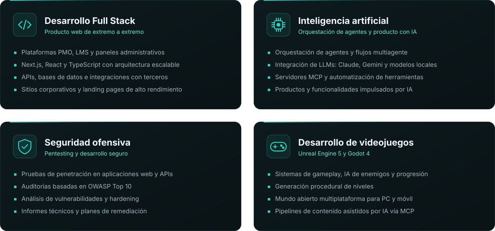

  

  

  
  
  

 

## Sobre mí

Ingeniero de software con un perfil integral: **desarrollo full stack, inteligencia artificial y seguridad ofensiva**. Diseño y construyo plataformas para empresas, desde la arquitectura hasta el despliegue, con foco en rendimiento, escalabilidad y una experiencia de usuario cuidada.

Trabajo con **IA como parte central de mi forma de construir**: orquesto agentes, integro modelos de lenguaje en productos reales y automatizo flujos completos de desarrollo. Esto me permite entregar más rápido sin sacrificar calidad.

Mi formación en **pentesting** me permite abordar cada proyecto con mentalidad de atacante: identifico vulnerabilidades antes de que lleguen a producción y aplico prácticas de desarrollo seguro en cada capa.

- Desarrollo de producto en **EIAN INNOVA**: plataformas PMO, LMS y herramientas internas
- Orquestación de agentes de IA, servidores MCP e integración de LLMs
- Auditoría de aplicaciones web bajo OWASP Top 10 y pruebas de penetración
- Desarrollo de videojuegos con Unreal Engine 5 y Godot 4

 

## Qué hago

  

## Stack

| Área | Tecnologías |
| :-- | :-- |
| **Lenguajes** |  |
| **Frontend** |  |
| **Backend y datos** |  |
| **Mobile** |  |
| **Inteligencia artificial** |      |
| **Seguridad ofensiva** |       |
| **Videojuegos** |  |
| **DevOps y herramientas** |  |

## Metodología de pentesting

  

## Proyectos

  
  
  
  

**Trabajo privado y para clientes**

| Proyecto | Descripción | Tecnología |
| :-- | :-- | :-- |
| **EIAN PMO** | Oficina de gestión de proyectos con seguimiento de tiempos y recursos | TypeScript |
| **IEAN Course** | Plataforma de formación con administración de cursos en video | TypeScript |
| **BPM LexFlow** | Modelado y automatización de procesos de negocio | TypeScript |
| **Traductor** | Traducción de documentos con clasificación automática de textos | TypeScript |
| **uninformadomas** | Portafolio y espacio de formación para hackers junior | TypeScript |
| **Administrador de pagos** | Gestión, control y seguimiento de pagos | TypeScript |
| **Serenco** | Plataforma comercial para venta de maquinaria pesada | TypeScript |
| **Radio Pasillo** | Plataforma de radio web | JavaScript |
| **Sitios corporativos** | MCA Consulting, Audit and Accounting, ARMF Outsourcing, Préstamo Ya | TypeScript / Astro |

## Actividad

  
  

  

  

